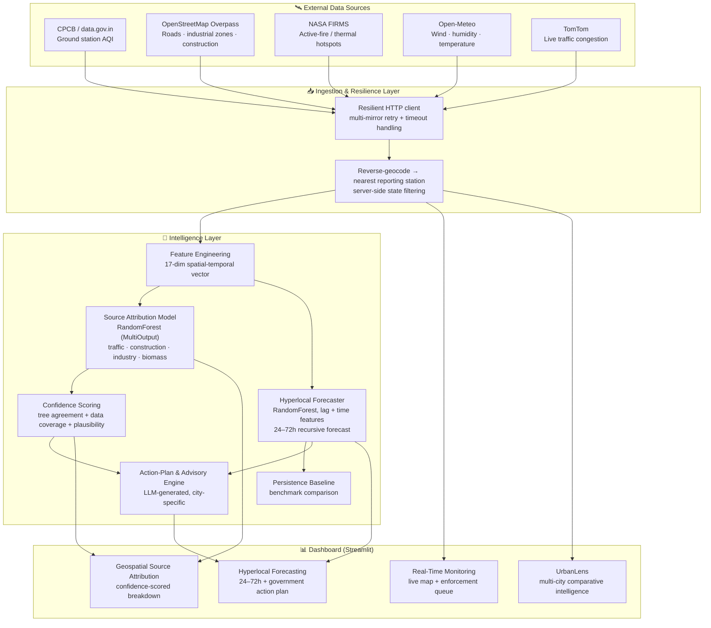
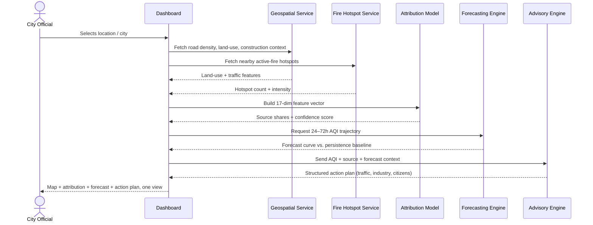

# 🌫️ Urban Air Quality Intelligence

**A geospatial AI platform that turns raw air-quality readings into evidence-backed, source-attributed, hyperlocal intervention plans for city administrators — not just another dashboard.**

🔗 **Live demo:** [your-deployment-url-here.netlify.app](https://your-deployment-url-here.netlify.app) *(update after deploy)*

---

## The Problem

India's air quality crisis isn't a Delhi problem — it's a national one. Delhi averaged an AQI of 218 through 2024–25 (classified "Poor" or worse for 200+ days), Mumbai logged dangerous AQI on 60+ days, Kolkata sat above 150 for most of winter, and even traditionally cleaner cities like Bengaluru and Chennai are deteriorating as vehicle density and construction surge. 24 of India's 50 most polluted cities are Tier-1/Tier-2 urban centres, and the public-health cost is estimated at over a million and a half premature deaths a year.

Here's the paradox: India already runs 900+ Continuous Ambient Air Quality Monitoring Stations under the National Clean Air Programme. **The data exists.** What's missing is the intelligence layer on top of it — most cities have *readings*, not *reasons*. A number on a dashboard doesn't tell an official whether today's spike is traffic, construction dust, industrial emissions, or crop-residue burning, what it'll look like in 48 hours, or which ward to send an inspector to first. That gap — between raw monitoring and actionable, source-specific intervention — is what keeps administrations reactive instead of proactive.

## Our Approach

We built a platform around three questions a city administrator actually needs answered, in order:

1. **What's happening right now, and where?** — real-time station-level monitoring on an interactive map.
2. **Why is it happening?** — a geospatial source-attribution model that breaks a pollution reading down into traffic / construction / industrial / biomass-burning shares, with a confidence score, not just a single AQI number.
3. **What happens next, and what should we do about it?** — hyperlocal 24–72h forecasting plus an auto-generated, city-specific action plan (traffic control, industrial curbs, citizen advisories) grounded in interventions that have actually worked in other cities.

The system is built as a live pipeline, not a static demo: every panel is wired to the same underlying data flow, and the same request that populates the map also feeds the forecaster, the attribution model, and the advisory generator.

---

## Architecture



### Request flow: from a map click to an action plan



---

## Key USPs

### 1. Source attribution, not just AQI numbers
Most dashboards stop at "AQI is 312." We go one layer deeper: a RandomForest model trained on a 17-dimensional spatial-temporal feature vector (road density, industrial land-use ratio, construction site density, fire hotspot proximity, wind, humidity) splits a reading into **traffic / construction / industrial / biomass-burning shares**, each with a confidence score. That's the difference between "pollution is high" and "pollution is high *because of this*, and here's how confident we are" — which is what turns a reading into an enforcement decision.

### 2. Confidence is a first-class output, not an afterthought
Every attribution comes with a transparent 0–100 confidence score combining ensemble tree agreement, live-data coverage, and reading plausibility — so an official knows when to trust the call and when to send someone to verify in person, instead of treating every model output as gospel.

### 3. Forecasts benchmarked against a real baseline
The forecaster doesn't just predict — it reports its own accuracy against a persistence baseline ("tomorrow = today"), the same standard used to evaluate operational forecasting systems. That number is shown in the UI, not buried in a notebook.

### 4. From forecast to enforcement, automatically
The enforcement priority queue and the auto-generated action plan close the loop: instead of handing an official a chart, the platform recommends *what to do* — traffic control, industrial curbs, construction restrictions, citizen advisories — grounded in interventions real cities (Delhi's GRAP, Beijing, Seoul, London's ULEZ) have actually used.

### 5. Built for degraded connectivity, by design
Every external dependency — station data, traffic, weather, fire hotspots, geospatial context — sits behind a resilient client with multi-mirror retry and a same-schema fallback path, so a flaky API or venue Wi-Fi never produces a blank panel or a crashed session. This isn't a corner cut; it's the same defensive pattern production monitoring systems use, because a pollution dashboard that goes dark during a spike is worse than useless.

### 6. Multi-city by default, not hardcoded
Switching cities isn't a separate build — the same pipeline re-runs end to end for any supported city, and **UrbanLens** overlays multiple cities' trends so administrators can see which interventions are actually working elsewhere before adopting them locally.

### 7. Explainable end-to-end
RandomForest over deep learning was a deliberate call: with limited historical station data, a well-featured tree ensemble generalizes better than a deep model would, and it gives honest `feature_importances_` — every prediction, whether forecast or attribution, can be traced back to *why* the model said what it said. No black boxes in a system meant to justify enforcement action.

---

## Feature Breakdown

| Module | What it does |
|---|---|
| **Real-Time Monitoring** | Live station map, city-level AQI summary, trend deltas, enforcement priority queue ranked by severity |
| **Geospatial Source Attribution** | 4-way source breakdown (traffic/construction/industry/biomass) with confidence scoring and feature-importance explainability |
| **Hyperlocal Forecasting** | 24–72h recursive AQI forecast per city/station, benchmarked against a persistence baseline, feeding directly into the advisory engine |
| **Government Action Plan & Citizen Advisory** | Auto-generated, structured recommendations across traffic control, vehicle emissions, industrial curbs, agricultural/biomass control, and citizen health guidance |
| **UrbanLens (Multi-City Intelligence)** | Comparative view across cities to benchmark trends and intervention effectiveness |
| **Pollution Source History** | Contextual brief on industrial sites and biomass-burning incidents near a location, framed as investigative context for an officer to verify — not an authoritative record |

---

## Tech Stack

- **Frontend/App:** Streamlit, Folium (interactive maps), Plotly
- **ML:** scikit-learn (RandomForest, MultiOutputRegressor), joblib for model persistence
- **Data layer:** pandas, numpy, httpx (async), pydantic-settings
- **External data:** CPCB (via data.gov.in), OpenStreetMap Overpass, NASA FIRMS, Open-Meteo, TomTom
- **Generative layer:** LLM-based action-plan and advisory generation over a structured JSON schema

---

## Quick Start

```bash
git clone https://github.com/Kanan2005/air-quality-intelligence/
cd air-quality-intelligence
pip install -r requirements.txt

# Add your API keys 
# GOVT_AQI_API_KEY, TOMTOM_API_KEY, GROQ_API_KEY, NASA_FIRMS_MAP_KEY

python -m streamlit run dashboard/app.py
```

Opens at `http://localhost:8501`.

---

## Roadmap

- Sentinel-5P satellite ingestion (NO₂ / aerosol index layers) via Google Earth Engine for finer-grained attribution
- Replacing the time-pattern heuristic with a spatial join against OSM land-use polygons
- Multilingual citizen advisories (regional-language IVR and push alerts)
- Ward-level population vulnerability mapping (hospitals, schools, elderly populations)

---

## Project Structure

```
air-quality-intelligence/
├── ingestion/             # Live + sample data acquisition
├── geospatial/            # Source attribution model, context services, explainability
├── forecasting/           # RandomForest hyperlocal forecaster + baseline benchmark
├── hyperlocal_forecast/   # Weather + advisory helpers
├── dashboard/             # Streamlit application
└── docs/                  # Architecture notes
```
